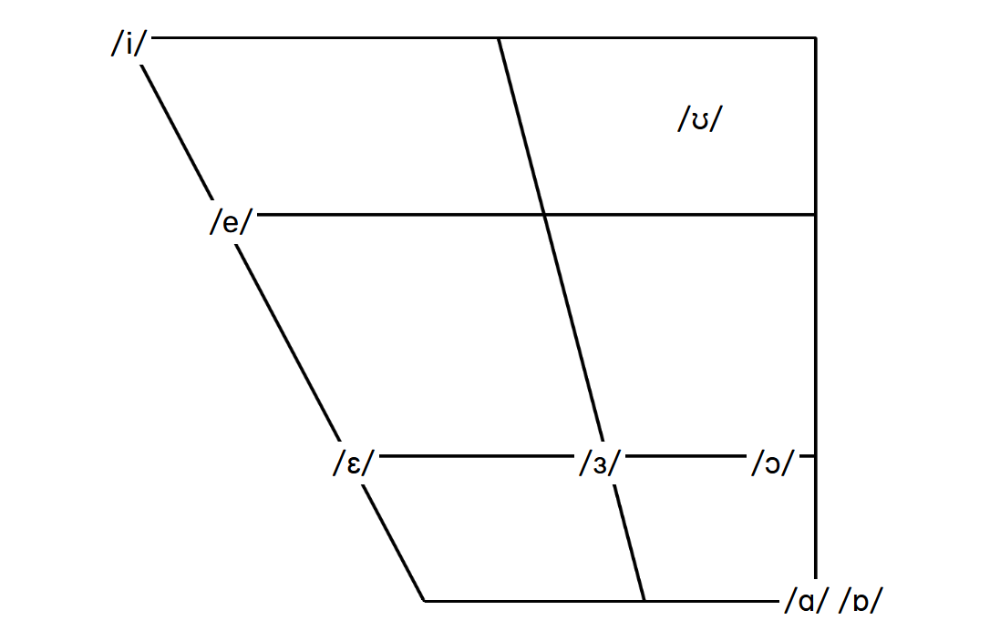

# Gorgus-Translator
A translator for a conlang called Gorgus me and some friends are actively working on.

# Phonology
Here is the phonology of the Gorgus conlang:

## Consonants

<table>
  <thead>
    <tr>
      <th></th>
      <th><strong>Bilabial</strong></th>
      <th><strong>Labiodental</strong></th>
      <th><strong>Dental</strong></th>
      <th><strong>Alveolar</strong></th>
      <th><strong>Postalveolar</strong></th>
      <th><strong>Retroflex</strong></th>
      <th><strong>Palatal</strong></th>
      <th><strong>Velar</strong></th>
      <th><strong>Uvular</strong></th>
      <th><strong>Pharyngeal</strong></th>
      <th><strong>Glottal</strong></th>
    </tr>
  </thead>
  <tbody>
    <tr>
      <td><strong>Plosive</strong></td>
      <td>/p/ /b/</td>
      <td></td>
      <td colspan="3">/t/ /d/</td>
      <td></td>
      <td></td>
      <td>/k/ /g/</td>
      <td></td>
      <td></td>
      <td></td>
    </tr>
    <tr>
      <td><strong>Nasal</strong></td>
      <td>/m/</td>
      <td></td>
      <td colspan="3">/n/</td>
      <td></td>
      <td></td>
      <td>/ŋ/</td>
      <td></td>
      <td class="grey"></td>
      <td class="grey"></td>
    </tr>
    <tr>
      <td><strong>Trill</strong></td>
      <td></td>
      <td></td>
      <td colspan="3">/r/</td>
      <td></td>
      <td></td>
      <td class="grey"></td>
      <td></td>
      <td></td>
      <td class="grey"></td>
    </tr>
    <tr>
      <td><strong>Fricative</strong></td>
      <td></td>
      <td>/f/</td>
      <td></td>
      <td>/s/ /z/</td>
      <td>/ʃ/</td>
      <td></td>
      <td></td>
      <td></td>
      <td></td>
      <td></td>
      <td>/h/</td>
    </tr>
    <tr>
      <td><strong>Approximant</strong></td>
      <td></td>
      <td></td>
      <td colspan="3">/ɹ/</td>
      <td></td>
      <td>/j/</td>
      <td></td>
      <td></td>
      <td></td>
      <td class="grey"></td>
    </tr>
    <tr>
      <td><strong>Lateral approximant</strong></td>
      <td class="grey"></td>
      <td class="grey"></td>
      <td colspan="3">/l/</td>
      <td></td>
      <td></td>
      <td></td>
      <td></td>
      <td class="grey"></td>
      <td class="grey"></td>
    </tr>
  </tbody>
</table>

## Vowels

# Install

### Install Requirements
- Python < 3.13 (3.13 does not work with the spacy Python module, 3.12.9 is recommended)
- Git (for automatic updates)

### Actual Install
> [!IMPORTANT]
> Make sure you `git clone` the repository! This means the `.git` folder is present, otherwise auto-updates won't work!
> Download command: `git clone https://github.com/SpookyDervish/Gorgus-Translator`

First of all, you need a version of Python less than 3.13 as 3.13 is not supported.

If you're on Windows you can run the `install.bat` file and it will do everything for you,
for MacOS and Linux the bash script `install.sh` for installing and `run.sh` will do the heavy lifting.

And you should be all set!

Then, just run `main.py`.

# Updating
The app will tell you when you need updates, and you can apply them when needed.